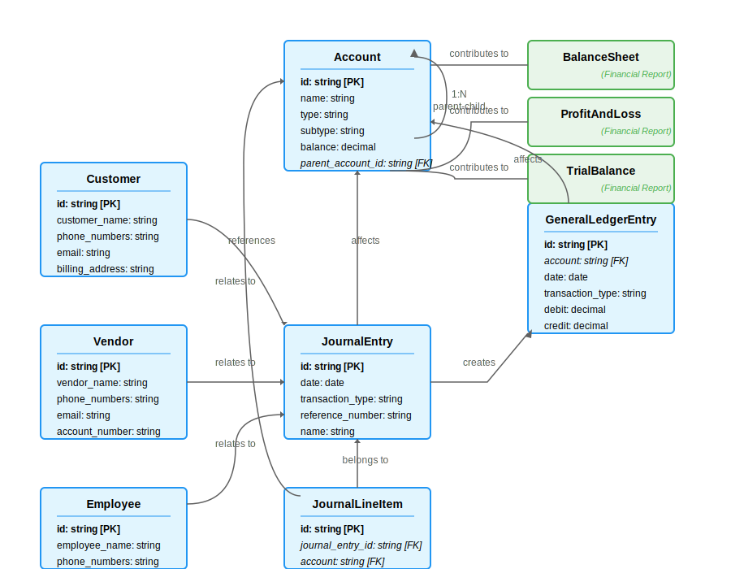

# Quickbooks/Intuit + Sage AI Oracle

## Techstack

- Supabase
- Clerk Auth
- NextJS
- Shadcn/UI
- OpenAI + Vercel AI SDK

## Intuit

### Quickbooks Data Model

The Quickbooks integration provides access to the following data model:

The diagram shows the relationships between key Quickbooks entities including:

- Company (CompanyInfo)
- Accounts
- Customers
- Vendors
- Items
- Transactions (Invoices, Payments, Bills)
- Estimates and Purchase Orders

## Documentation

### Quickbooks API Documentation

For detailed information about the Quickbooks API integration, refer to the [Quickbooks API Documentation Table of Contents](docs/quickbooks/00-quickbooks-api-toc.md).

### SAGE API Documentation

For detailed information about the SAGE Connect API integration, refer to the [SAGE Connect API Documentation Table of Contents](docs/sage/00-sage-connect-api-toc.md).

[x] - account
[x] - company-into
[x] - purchase
[x] - purchase-order
[x] - vendor
[x] - webhooks
[ ] - customer
[ ] - estimate
[ ] - bill
[x] - invoice
[x] - item
[x] - payment
[ ] - profit-and-loss
