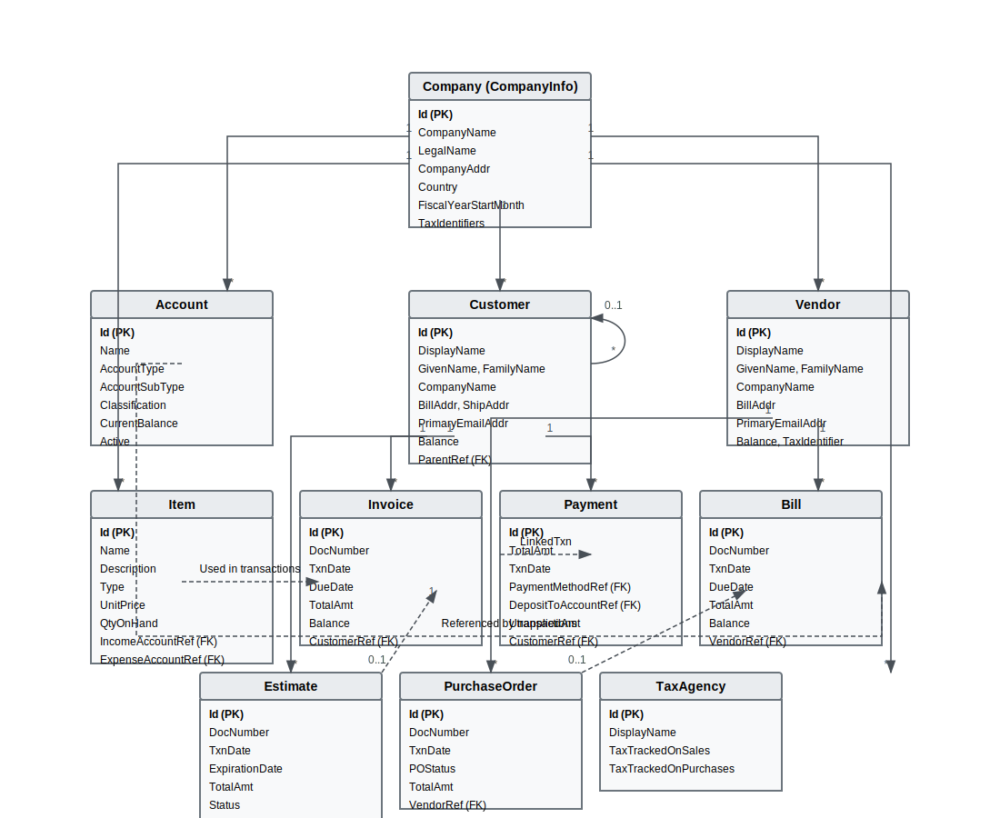

# Quickbooks/Intuit + Sage AI Oracle

## Techstack

- Supabase
- Clerk Auth
- NextJS
- Shadcn/UI
- OpenAI + Vercel AI SDK

## Intuit

### Quickbooks Data Model

The Quickbooks integration provides access to the following data model:

The diagram shows the relationships between key Quickbooks entities including:

- Company (CompanyInfo)
- Accounts
- Customers
- Vendors
- Items
- Transactions (Invoices, Payments, Bills)
- Estimates and Purchase Orders

# User hits create

# The product database has to be Quickbooks compatible

## Two main screens

1. Create Estimate screen
   A. Must be able to create & view customers
   B. Want the ability to create a purchase order directly from the estimate screen for every related or relevant vendor in the estimate doc.
2. Create Purchase Order Screen
3. Edit Purchase Order Screen

## Email Received from Customer triggers an Agentic Workflow routine to process the email content from the user and generate all the appropriate Intuit form completions, prepared and ready for the "Human in the Loop" check in prior to the next juncture 'finalization' or 'return correspondence'

**Quickbooks is made for accounting, SAGE is made for order taking**

I should take another look at a SAGE work order form.

**Obfuscate All potentially sensitive or permission based financial data**
